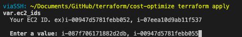
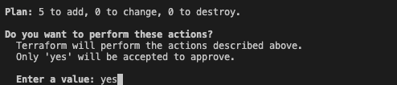
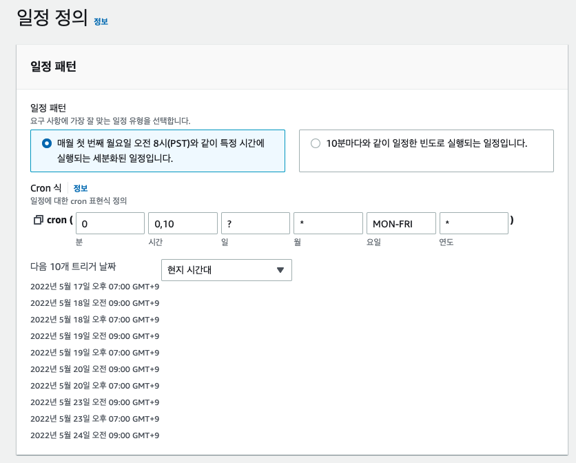

# 테라폼을 사용한 EC2 자동화 설정방법

1. 테라폼 설치
2. 테라폼을 실행한 AWS 프로파일을 가져와야한다.
   - `
   provider "aws" {
    region  = "ap-northeast-2"
    profile = "YOUR_PROFILE" # 여기를 변경
    }`
    - profile을 변경
3. terraform init
4. terraform apply
5. apply를 하면 input에 자동화 할 EC2의 id 를 컴마로 구분하여 입력한다.
   - EX) i-087f706171882d2db, i-00947d5781febb055

- 자동 시작은 한국시간 기준 오전 9:00, 자동 종료는 19:00에 꺼지게된다.

### EC2 아이디 입력

### 입력 완료 후 yes 입력

### CRON 예시

### 기대효과
24시간 돌고있는 인스턴스를 위 크론과 같이 미사용 시간에 끄게되면 58%의 비용을 아낄 수 있다.
- 19:00 ~ 익일 09:00 OFF 기준
